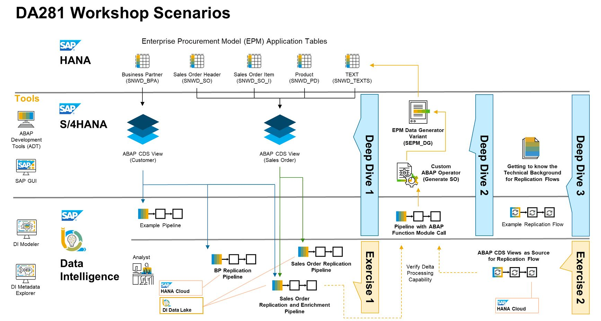

# DA281 - Hands-On Session for SAP Data Intelligence: Connectivity and Integration

## Description

This repository contains the material for the SAP TechEd 2022 session called DA281 - Hands-On Session for SAP Data Intelligence: Connectivity and Integration.

## Overview

SAP Data Intelligence is our leading solution for data integration, management, processing, and orchestration across different data environments. Through hands-on experience focused on connectivity and system interoperability with ABAP systems, see how to use corresponding built-in operators in the SAP Data Intelligence solution to integrate with SAP S/4HANA, SAP Business Suite software, and the SAP BW/4HANA solution, or with technologies such as SAP Landscape Transformation Replication Server.

## Requirements

The requirements to follow the exercises in this repository are:

- Basic knowhow about the usage and scope of S/4HANA
- General understanding of Enterprise Data Management and ETL (Extraction, Transformation, Load)
- Basic programming skills in ABAP are of advantage

## Deep Dive Demos and Hands On Exercises

The main use cases behind this workshop are:
- The extraction the Business Partner master data in S/4HANA's demo application Enterprise Procurement Model (EPM) and making the records available for the corporate Data Analysts in SAP HANA Cloud database.
- Also persist the transactional data in HANA Cloud, i.e for EPM Sales Order objects which are built from joins over multiple EPM tables.
- In both cases, any single change of these data sources in the S/4HANA system has to be instantly and automatically replicated to the related tables in HANA.
- Additionally, the Sales Order data have to be enriched with Customer master data, for the initial load and then on every change committed to the EPM Sales Order data in S/4HANA.
- In order to create test changes on the EPM Sales Order data without having access to the SAP GUI in the S/4HANA system, (a variant of) the EPM Data Generator reports needs to be executed as an ABAP Function Modul call from a Data Intelligence Pipeline.
- The possibility of Replication Management System with the replication of CDS Views into a HANA Cloud target system

The Deep Dive live demos and the hands-on Exercise contents reflect the above scenarios and provide a consecutive approach for their realization. But other than during the on-site TechEd events in the past years, it was not feasible to provide the Eclipse based ABAP Development Tools (ADT) and the SAP GUI to our participants in the this year's virtual version of the TechEd.

Since it is a goal of this workshop to show and get the hands on the complete end-to-end implementation processes of ABAP integration with SAP Data Intelligence, all parts of this session that require these (local) applications will be presented as live Deep Dive demos, conducted in ADT and in SAP S/4HANA by the trainer, the Exercises - in opposite - are then performed by the participants in SAP Data Intelligence and will leverage those artifacts in S/4HANA that got created during the Deep Dive demos.

## Deep Dives & Exercises
- [Overview and Getting Started](exercises/ex0/README.md#overview-and-getting-started)
  - [Deep Dive demos vs. Exercises](exercises/ex0/README.md#deep-dive-vs-exercise-sections-in-this-document)
  - [Short introduction to the Enterprise Procurement Model (EPM) in ABAP systems](exercises/ex0/README.md#short-introduction-to-the-enterprise-procurement-model-epm-in-sap-s4hana)
  - Access to the exercises' Data Intelligence environment (**will be provided after the session**)
- [Deep Dive 1 - ABAP CDS View based data extraction in SAP Data Intelligence](exercises/dd1/README.md#deep-dive-1---abap-cds-view-based-data-extraction-in-sap-data-intelligence)
- [Deep Dive 2 - Creating a Custom ABAP Operator and making use of it in an SAP Data Intelligence Pipeline](exercises/dd2/README.md)
- [Deep Dive 3- Technical Background for Replication Flows in SAP Data Intelligence](exercises/dd3/README.md)

- [Overview and Getting Started](exercises/ex0/README.md#overview-and-getting-started)

- [Exercise 1 - Replicating data from S/4HANA ABAP CDS Views in SAP Data Intelligence](exercises/ex1/)
    - [Exercise 1.1 - Consume the EPM Business Partner ABAP CDS Views in SAP Data Intelligence](exercises/ex1#exercise-11-sub-exercise-1-description)
    - [Exercise 1.2 - Extend the Pipeline to transfer the Customer data into a HANA Cloud Database with Initial Load mode](exercises/ex1#exercise-12-sub-exercise-2-description)
    - [Exercise 1.3 - Implement a Pipeline for delta transfer of enhanced EPM Sales Order data from S/4HANA to an S3 Object Store](exercises/ex1#exercise-13-sub-exercise-1-description)
    - [Exercise 1.4 - Extend the Pipeline for joining Sales Order with Customer data for each change in Sales Orders and persist results in S3](exercises/ex1#exercise-14-sub-exercise-1-description)
    - [Exercise 1.5 - Using a custom ABAP Operator to verify your Delta Replication of EPM Sales Orders](exercises/ex2/)

- [Exercise 2 - Integrate ABAP CDS Views in SAP Data Intelligence Replication Management Flow](exercises/ex3/README.md#exercise-3---integrate-abap-cds-views-in-sap-data-intelligence-replication-management-flow)
  

Here is a graphical overview about the topics and processes that we will focus on during this hands-on workshop and how they relate to each other.  

## How to obtain support

Support for the content in this repository is available during the actual time of the online session for which this content has been designed. Otherwise, you may request support via the [Issues](../../issues) tab.

## License
Copyright (c) 2022 SAP SE or an SAP affiliate company. All rights reserved. This project is licensed under the Apache Software License, version 2.0 except as noted otherwise in the [LICENSE](LICENSES/Apache-2.0.txt) file.
