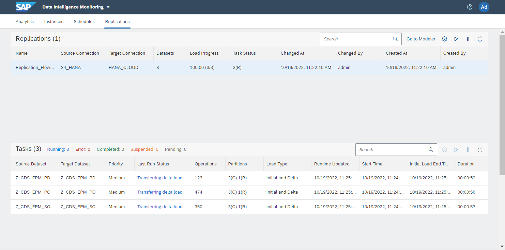
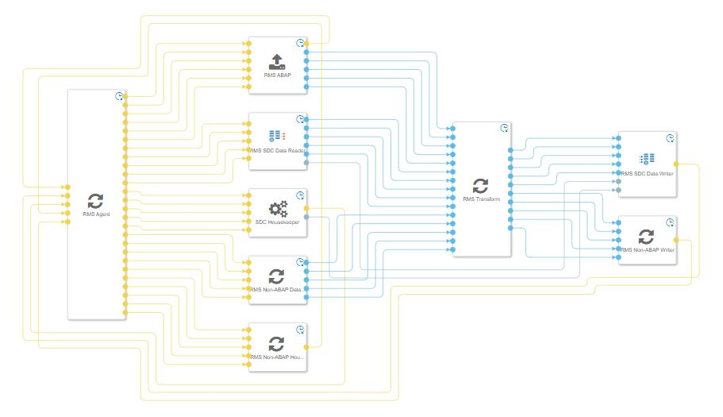

# Deep Dive 3 - Replicating data using Replication Flows in SAP Data Intelligence

Technically you can realize data replication use cases using SAP Data Intelligence pipelines, but there are also some important considerations and limitations to mention when using pipelines for such a scenario.  

  

The following generation 2 pipeline illustrates an example for a simple 1:1 replication of data from an SAP source into a file object store as a target.  

 

Important aspects to highlight are:
- 1 data set replication ≙  1 pipeline in Data Intelligence with possibility to generalize pipeline execution with variables in certain scenarios

- Recovery of data integration pipelines in case of various error situations using resilience & snapshot functionality in generation 2 pipelines

- High total cost of ownership (TCO) when having large amount of data sets (e.g. hundreds or thousands of CDS Views or tables) in a replication use case which results in creating as well as maintaining a lot of Data Intelligence pipelines

- Limited performance scalability in pipelines, e.g. in the area of parallelizing initial as well as delta load processes
  

### **Overview of Replication Flow core functionality**

Therefore, replication flows provisioned via the so called "Replication Management Service (RMS)" have been made available to simplify the realization of data replication use cases in SAP Data Intelligence Cloud. Whereas RMS includes the whole data replication service incl. its dependent components, a "Replication Flow" is the name of the artefact that a user is creating & maintaining inside the SAP Data Intelligence Cloud Modeler application. The main capabilities and functional foundation are visualized in the following illustration:
  

 

The main functionalities of Replication Flows cover:

- Model data replication from a selected source to a selected target. In this case a more simplified way of realizing "mass data replication use cases" is being offered to move data very easy from a source to a target system

- Initial focus on 1:1 replication of with simple projections and filters, e.g. adding, adjusting and removal of columns as well as ability to provide row-level filters on one or multiple columns

- Dedicated user interface for modeling mass data replication via a new interface that is embedded in the existing modeler application and optimized for mass data replication scenarios to offer a simplified user experience

- Lower total cost of ownership (TCO) and total development costs (TDC) for customers realizing mass data replication scenarios in SAP Data Intelligence Cloud compared to using pipelines for such use cases.

- Support initial load as well as delta load capabilities, which is based on trigger-based change-data-capture (CDC) using logging tables on the connected source systems

- Support parallelization during initial load through partitioning to achieve a parallelized data load

- Support resiliency functionalities & automated recovery in case of error scenarios and also during maintenance of SAP Data Intelligence Cloud

 

### **Overview of Replication Flow Connectivity**

Looking at the supported source & target connectivity, different SAP and non-SAP connectivity can currently be used when creating a Replication Flow, which can also be checked in our product documentation under the following Link.

**[Replication Flow source and target connectivity ](https://help.sap.com/docs/SAP_DATA_INTELLIGENCE/ca509b7635484070a655738be408da63/f4327d3e2f7146a19e76924f8a79454a.html)** 

The supported source connectivity includes:

- SAP S/4HANA Cloud
- SAP S/4HANA on-Premise
- SAP Business Suite & SAP S/4HANA Foundation via SLT
- SAP Business Warehouse 
- Azure MS SQL

The supported target connectivity includes:

- SAP HANA Cloud
- SAP HANA Data Lake Files (HDL-Files)
- Amazon S3
- Microsoft Azure Data Lake Gen 2
- Google Cloud Storage 
- Kafka

There are partially special configurations available for specific target connections, such as different file formats for target objects stores (e.g. CSV, Parquet etc.) as well as data format & compression for Kafka as a target. More information about these configuration settings can be found in our product documentation. 

**[Connectivity configuration parameters ](https://help.sap.com/docs/SAP_DATA_INTELLIGENCE/1c1341f6911f4da5a35b191b40b426c8/a425e3426b644b1184207d291a856119.html)**

 

 

### **Create a Replication Flow in SAP Data Intelligence Cloud** 
This sub-chapter will provide an overview for how to create a Replication Flow including an explanation for all relevant settings a user needs to define in the different steps.

You can also get additional information for a step by step in the exercise chapter of this hands-on session: **[Replication Flow Exercises](../ex3/README.md)**

 

#### **Configuration settings in the Properties tab**
 
First of all we will start inside the Modeler application in SAP Data Intelligence, where you can create a Replication Flow and provide a name:

  

 

 

- Description

Provide an optional description for your Replication Flow, otherwise you can leave it empty.

 

- Source Connection

Define your source connection from the connection management. Be aware that the list is filtered by connection types that are supported by Replication Flows as a source system. 

 

- Source Container

Define the source container. In case of a database it is the database schema, but in case of ABAP it is the logical object you want to replicate (CDS (= CDS Views), SLT(tables), or ODP_SAPI / ODP_BW for ODP objects).

 

- Target Connection

Define your target connection from the connection management. Be aware that the list is filtered by connection types that are supported by Replication Flows as a target system.

 

- Target Container

Define the target container. In case of a database it is the database schema and in case of an object store it is target root folder in which you want to replicate the data. In case of Kafka as a target no target container is needed as we directly replicate into topics of a Kafka broker without the need of a target container.

 

- Target connection specific properties that are automatically popping up in the user interface if a certain connection is being specified.  
  - Object Stores (AWS S3, GCS, Azure Data Lake Gen 2, HDL Files)
    - *Group Delta By* (Date, Time) allowing users to define if the delta records should be automatically grouped in folders based on date or time.
    - *File Type* (CSV, Parquet, JSON, JSONLines)
    - *Compression* (for Parquet)
    - *Delimiter* (for CSV)
    - *Header Line* (for CSV)
    - *Orient* (for JSON)

     
   - Kafka
     - *Serialization type* (json, avro)
     - *Compression* (none, gzip, snappy, lz4, zstandard)
     - *Number of partitions* (integer number, default is 1)
     - *Replication Factor* (integer number, default is 1)

 

The below picture illustrates some of configurations available for object stores:
 

 

#### **Configuration settings in the Tasks tab**

Once you have defined the main configurations settings in the *Properties* tab, you can go to the *Tasks* tab of your Replication Flow. Inside this tab you will add the actual data sets to your Replication Flow and map it to your target data set. 
 

Open the *Tasks* tab  

Click the Create button to add one or multiple data sets, e.g. a CDS View, into your Replication Flow.
For each selected data set you can perform the following configurations:

 

- Source

Represents your selected source data set and cannot be changed once selected.

- Source Filter

Optionally you can define a filter on one or multiple columns if you do not want to load the complete source data set.

- Mapping

By default all columns from the source data set are being replicated to the target data set using an auto mapping with the exact same column names in the source & target data set. You can use the mapping dialog to customize the standard mapping, e.g. if the column names differ from each other.
Additionally, you can remove columns that are not needed and also create additional columns and either map new columns to existing column of fill it with constant values or pre-defined functions (e.g. CURRENT_DATE). Please note that when browsing and selecting a pre-defined target data sets, e.g. a table in HANA Cloud, you can create additional columns.

- Target

Select the target data set in which the data should be replicated. By default, the same name from the source data set is being used, but you can also change the default name and either select a pre-defined target data set or let the Replication Flow create the target data set.

- Load Type

Select the load type for each Task where you can select Initial  Only or Initial and Delta. Initial Only will load the data via a full load without any change data capture (CDC) or delta capabilities. Initial and Delta will perform the initial load of a data set followed by replicating all changes (inserts, updates, deletes) for this data set.
Furthermore, the required technical artefacts on the source to initiate the delta processes are automatically being created.

- Truncate

A check box that allows users to clean-up the target data set, e.g. in case a user want to re-initialize the data replication with a new initial load.

 

 

Before you can run a Replication Flow, you can hit the *Validate* button in the top menu bar 

to check if all necessary configurations are specified. If this is the case, you should receive a popup indicating that validation was successful:

 

 

Next, you can *Deploy* the Replication flow by clicking the deploy button in the top menu bar:

 

The deployment process will make sure that the necessary run-time artefacts are being generated before you can finally start a Replication Flow by clicking the *run* button.

#### **Monitoring of Replication Flows**

Monitoring Replication Flows is embedded inside the SAP Data Intelligence Modeler application. You can either use the *Go To Monitoring* button inside the Modeler application within the Replication Flow dialog or directly open the Monitoring application from the SAP Data Intelligence Launchpad:
 

The monitoring of Replication Flows is divided into two layers. In the first layer on the top of the screen shows an overview of the different Replication Flows existing in the SAP Data Intelligence Cloud tenant and in the second layer on the bottom of the screen you can find detailed information for the different Tasks for each selected Replication Flow.

 

 

In the first layer of the screen you can find the following information for each Replication Flow:
 

- Name = Name of the Replication Flow
- Source Connection = Defined source connection
- Target Connection = Defined target connection
- Datasets = Number of data sets / tasks existing in the Replication Flow
- Progress = Overall progress of initial load of all Tasks
- Changed At = Timestamp when the Replication Flow changed the last time
- Changed By = The user who changed the Replication Flow the last time
- Created By = User who created the Replication Flow
- Created At = Timestamp when the Replication Flow was created

 

 

In the second layer of the screen you can find the following information about the Tasks once you select a Replication Flow with your mouse in the first layer:

- Source data set = Defined source data set name
- Target data set = Defined target data set name
- Priority = priority of the Task
- Last Run Status = Status of each Task (e.g. Transferring delta load)
- Operations = row count per Task, which includes both record count for initial load as well as delta load
- Partitions = number of partitions defined for each Task for parallelization
- Load Type = Load type that has been defined in the modeler application
- Runtime updated = Timestamp indicating when last package was processed
- Start Time = Start Time of the Task 
- Initial Load End Time = Time at which the initial load ended
- Duration = time needed to perform the initial load

 

 

### **Overview of ABAP Integration with Replication Flows** 

The following sub-chapter describes a deep dive into the topic how a user can integrate the various types of SAP ABAP based systems as a source with Replication Flows. 

We will start with a first high level overview which kind of data sets & artefacts can be integrated with each SAP ABAP system.
  

 

Now we take this overview and provide some more granular view on the type of SAP System that can be integration with Replication Flows incl. a brief overview on the minimum version that is required. More information about the ABAP integration with SAP Data Intelligence can be found here: 
**[SAP Data Intelligence ABAP Integration ](https://launchpad.support.sap.com/#/notes/2890171)**

 

 

**Important Note:** It is always recommended to check the central SAP Note mentioned above as well as the individual SAP Note we have for each SAP ABAP System for the minimum pre-requisites as well as implementing all referenced SAP notes to fix known issues, e.g. for integrating SAP S/4HANA 2021 you can check the following  Note **[SAP Data Intelligence ABAP Integration - SAP S/4HANA 2021 ](https://launchpad.support.sap.com/#/notes/3085579)**
and for DMIS 2018 SP07 you can check this SAP Note **[SAP Data Intelligence ABAP Integration - DMIS 2018 SP07 ](https://launchpad.support.sap.com/#/notes/2890171)**.

 

### **Details on Replication Flow architecture**

In the underlying architecture Replication Flows are executed by so called "worker graphs", which internally built based on Data intelligence pipelines, but optimized for data replication use cases to overcome the limitations we have seen in the beginning of this deep dive when using regular pipelines.  

A worker graph is being executed in the background in case a user triggers the execution of a Replication Flow and mainly consists of the source & target connectivity + projection & mapping in case the user is defining a filter or changes the structure of the data set. Theoretically, there is no limit for a user to define how much data sets (also known as Tasks) can be added inside a single Replication Flow, but there are some important aspects we will highlight below that influences this decision. 

**Important Note:** A user cannot create such a Replication Flow on her/his own and should only be seen as the technical runtime artefact, which is automatically triggered when a Replication Flow is being executed.  
Please check below how a worker graph looks like:  
 

 

In contrast to pipelines, a single worker graph as illustrated above can replicate multiple data sets from the source to the target. Each worker graph has by default a total 10 connections (5 source & and 5 target connections) through which the data can be replicated and by default a single Replication Flow has two worker graphs assigned. This setting can be adjusted so that multiple worker graphs are started for a Replication Flow depending on the use case. Additional information can also be found under the following link:
**[Sizing Replications ](https://help.sap.com/docs/SAP_DATA_INTELLIGENCE/ea95bb6d8ac24cd6a4ad396ca5e35bc6/00ce7f17afcb40a287c1946b9abbafbe.html)**

The number of connections per replication flows can be figured in the monitoring application on tab "Replications" on a Replication Flow level using the configuration button. More information can be found here when looking for the actions in the "Replications" tab in the
**[Monitoring application ](https://help.sap.com/docs/SAP_DATA_INTELLIGENCE/ca509b7635484070a655738be408da63/e352e7f1a99e4b5d989db5ae1e5e5d0b.html)**

 

### **Important Links**

**[TechEd exercises for Replication Flows](../ex3/README.md)**
 

**[Step by Step Guide for creating a Replication Flow](https://help.sap.com/docs/SAP_DATA_INTELLIGENCE/1c1341f6911f4da5a35b191b40b426c8/d3acc43c77c848b6a82d899ff6895f99.html)**
 

**[Overview of supported source & target connections](https://help.sap.com/docs/SAP_DATA_INTELLIGENCE/ca509b7635484070a655738be408da63/f4327d3e2f7146a19e76924f8a79454a.html)**
 

**[Questions? SAP Community](https://community.sap.com/)**
 

**[SAP Data Intelligence ABAP User Guide](https://help.sap.com/docs/SAP_DATA_INTELLIGENCE/3a65df0ce7cd40d3a61225b7d3c86703/8b287f0f0033447c8a57a1bee74cd840.html)**
 

**[SAP Data Intelligence ABAP Integration - Central SAP Note](https://launchpad.support.sap.com/#/notes/2890171)**
 

