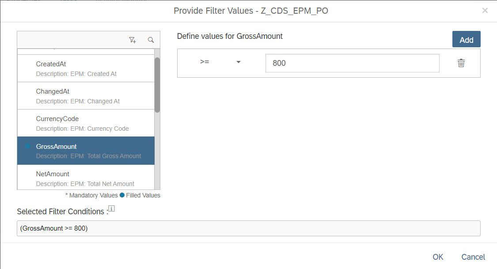
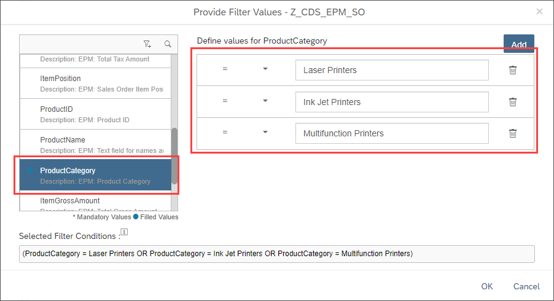
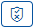
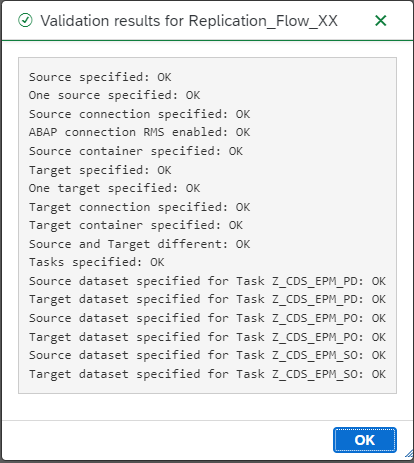

# Exercise 2 - Integrate ABAP CDS Views in SAP Data Intelligence Replication Management Flow
For the integration of ABAP CDS Views in S/4HANA, SAP Data Intelligence provides standard ABAP operator shells that can easily be configured according to your use cases. In principal, you can leverage the following approach:

> **Important**:
> 
> Replace the subfix XX within this exercise with your user ID of this exercise session.

1. Logon to SAP Data Intelligence to access the Launchpad application and click on the Modeler tile.

2. In the DI Modeler click on the right side the Replication tab in the middle to access the Replication Management Functionalities in Data Intelligence

3. Click on the Plus icon at the top of your window to create a new Replication Flow

4. Enter a name for the Replication Flow in the pop-up window

5. With the newly visible window we need to specify two different main parameter setting. One for the source system and the second for the target system. 
   
   Select the following details from the dropdown to set up the replication flow:
   - Source:
     - Source Connection: **S4_HANA (ABAP)**
     - Container: **CDS**
   - Target
      - Target Connection: **HANA_CLOUD (HANA_DB)**
      - Container: **TAXX_EPM**

6. After filling the necessary properties for the Replication Flow, we click on the Tasks tab to replicate the CDS View **Z_CDS_EPM_SO**. 
7. Click on the Create button to create a task for the CDS View replication

8. Select the CDS View by searching for the pattern Z_CDS and navigate to the TMP folder. Click on the CDS View **Z_CDS_EPM_SO**. To add the CDS View to the Replication Flow click the Ok button on the Pop-Up window
9. Repeat step 8 for the CDS views **Z_CDS_EPM_PO** and **Z_CDS_EPM_PD**.

10.  After adding all three CDS views to the created Replication Flow, change the Load Type of each CDS View from Initial Only to Initial and Delta over the drop-down menu in the column Load Type.

11. For the three CDS Views we define different preparations techniques which can be used for the replication. We differentiate between Filter and Mapping preparations
12. For the CDS View Z_CDS_EPM_PD we create a new column for the target table. Click therefore in the Mapping Column on the  icon
    - In the opened window click on the Create Button to create a new column
    - Change the Column Name in the last field to the name **TimestampReplication**
    - Set the Data Type to timestamp from the drop down
    - Add for the Column Expression the following function: CURRENT_UTCTIMESTAMP
    
    - Click on the **OK** Button to save the mapping for the CDS View Z_CDS_EPM_PD

13. For the CDS View Z_CDS_EPM_PO we want to filter the column GrossAmount for all rows which are >= 800 €. Click to filter the CDS View on the  icon
    - Scroll on the opened window until the column GrossAmount
    - Click on the left side on the left side on the field GrossAmount
    - Change the = operator to an >= from the drop-down
    -  Enter in the Value field on the ríght side the value **800**
    -  Click on the **OK** Button to save the mapping for the CDS View Z_CDS_EPM_PO
    

14. For the CDS View Z_CDS_EPM_SO we combine the mapping and filtering together for our replication. For the sales orders we are interested filtering for all printers within our orders. We want to also add within our replicated dataset a new column storing the exact timestamp of our replication
    - For the filtering of all printers click on the filter icon and scroll down to the column ProductCategory
    - In total three different printers are present within the ProductCategory column: **Laser Printers**, **Ink Jet Printers** and **Multifunction Printers**
    - To filter for all items we click two times on the Add button to have three rows present for the three product categories
    - Enter for each row in the filtering option one of the Product Categories as displayed in below picture
    

15. Click on the Validate button   to check if every check runs through smoothly. An ideal validation is displayed in belows image

17. After everything went through in the validation check we can deploy our Replication Flow by clicking on the deploy button 

18. After the deployment of the Replication Flow is completed, we can press the run button  to start the replication with our specified settings

19. After the replication is finished, click on the Data Intelligence Modeler banner at the top of the screen

20. In the Drop-Down menu click on the Metadata Explorer row to browse the replicated data

20. In the newly opened tab click on the Browse Connections option to navigate the HANA database we replicated our data to

21. To navigate to the replicated datasets click through with the following steps
    - Click on HANA_CLOUD tile
    - Click on TECHED_DA281 tile
    - Click for the replicated dataset **Z_CDS_EPM_SO**, on the glasses icon
    - Click for each dataset on the Data Preview tab and explore for each dataset the data replicated

22. Repeat step 21 for the CDS Views **Z_CDS_EPM_PO** and **Z_CDS_EPM_PD**

23.  After the replication flow has successfully run and you explored the data, execute the Custom ABAP operator created in [Exercise 2](../ex2/README.md#exercise-15---using-a-custom-abap-operator-to-verify-your-delta-replication-of-epm-sales-orders) to create new sales orders.

## Summary
In the Deep Dive demos and in the Exercises, we have jointly worked on the implementation of delta-enabled data sources and remote functionality in S/4HANA and have leveraged these features directly in SAP Data Intelligence. We could now extend these use cases for more complex scenarios. The general implementation approaches and the support that the Data Intelligence applications provide would then still be the same. 
In case you have asked yourself if there are similar options for the integration with other ABAP systems such as ECC or BW, the answer is 'yes'! In these cases, you can make use of the unmodifying DMIS add-on, which provides the ABAP Pipeline Engine also for these systems. 
This given, you can realize real-time replication scenarios via SLT integration to SAP Data Intelligence, leverage the ODP Reader operators, and also trigger function module execution on ECC or BW systems, too. 
More information about general ABAP integration with Data Intelligence can be found [here](https://blogs.sap.com/2019/10/29/abap-integration-for-sap-data-hub-and-sap-data-intelligence-overview-blog/). and an additional example on how to use Custom ABAP Operator with Data Intelligence can be found [here](https://blogs.sap.com/2021/06/01/integrating-abap-function-modules-with-sap-data-intelligence/).   
**THANK YOU VERY MUCH** for having participated in this Deep Dive and Hands On workshop. We hope you have enjoyed it!  
Martin Boeckling, Daniel Ingenhaag, Matthias Kretschmer, and Bengt Mertens  

*****************************************************
  **Table of Contents / Navigation**
 
- [Overview and Getting Started](../../exercises/ex0/README.md#overview-and-getting-started)
  - [Deep Dive demos vs. Exercises](../../exercises/ex0/README.md#deep-dive-vs-exercise-sections-in-this-document)
  - [Short introduction to the Enterprise Procurement Model (EPM) in ABAP systems](../../exercises/ex0/README.md#short-introduction-to-the-enterprise-procurement-model-epm-in-sap-s4hana)
  - Access to the exercises' Data Intelligence environment (**will be provided after the session**)
- [Deep Dive 1 - ABAP CDS View based data extraction in SAP Data Intelligence](../../exercises/dd1/README.md#deep-dive-1---abap-cds-view-based-data-extraction-in-sap-data-intelligence)
- [Deep Dive 2 - Creating a Custom ABAP Operator and making use of it in an SAP Data Intelligence Pipeline](README.md)
- [Deep Dive 3- Technical Background for Replication Flows in SAP Data Intelligence](../../exercises/dd3/README.md)

- [Overview and Getting Started](exercises/ex0/README.md#overview-and-getting-started)

- [Exercise 1 - Replicating data from S/4HANA ABAP CDS Views in SAP Data Intelligence](../../exercises/ex1/)
    - [Exercise 1.1 - Consume the EPM Business Partner ABAP CDS Views in SAP Data Intelligence](../../exercises/ex1#exercise-11-sub-exercise-1-description)
    - [Exercise 1.2 - Extend the Pipeline to transfer the Customer data into a HANA Cloud Database with Initial Load mode](../../exercises/ex1#exercise-12-sub-exercise-2-description)
    - [Exercise 1.3 - Implement a Pipeline for delta transfer of enhanced EPM Sales Order data from S/4HANA to an S3 Object Store](../../exercises/ex1#exercise-13-sub-exercise-1-description)
    - [Exercise 1.4 - Extend the Pipeline for joining Sales Order with Customer data for each change in Sales Orders and persist results in S3](../../exercises/ex1#exercise-14-sub-exercise-1-description)
    - [Exercise 1.5 - Using a custom ABAP Operator to verify your Delta Replication of EPM Sales Orders](../../exercises/ex2/)

- [Exercise 2 - Integrate ABAP CDS Views in SAP Data Intelligence Replication Management Flow](README.md)
  
