## Exercise x.x - Integrate ABAP CDS Views in SAP Data Intelligence Replication Management Flow
For the integration of ABAP CDS Views in S/4HANA, SAP Data Intelligence provides standard ABAP operator shells that can easily be configured according to your use cases. In principal, you can leverage the following approach:

**``Important: Replace the subfix XX within this exercise with your user ID of this exercise session.``**

1. Logon to SAP Data Intelligence to access the Launchpad application and click on the Modeler tile.

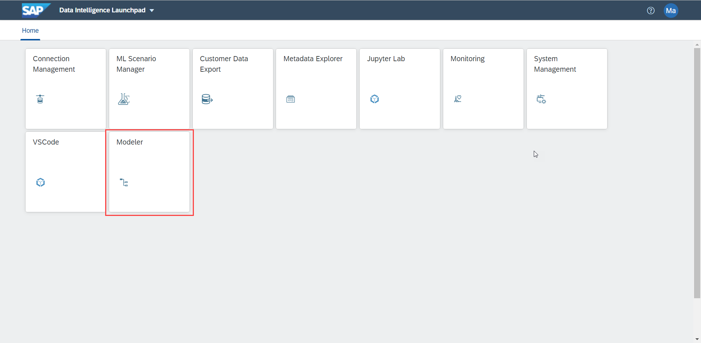

2. In the DI Modeler click on the right side the Replication tab in the middle to access the Replication Management Functionalities in Data Intelligence

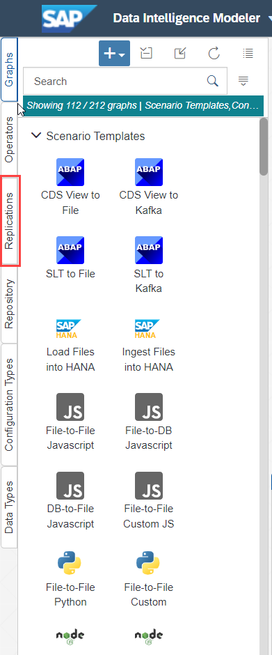

3. Click on the Plus icon at the top of your window to create a new Replication Flow

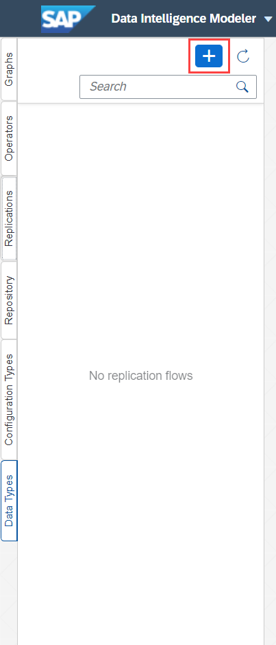

4. Enter a name for the Replication Flow in the pop-up window

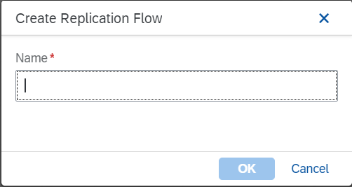

5. With the newly visible window we need to specify two different main parameter setting. One for the source system and the second for the target system. 
   
   Select the following details from the dropdown to set up the replication flow:
   - Source:
     - Source Connection: **S4_HANA (ABAP)**
     - Container: **CDS**
   - Target
      - Target Connection: **HANA_CLOUD (HANA_DB)**
      - Container: **TECHED_DA281**

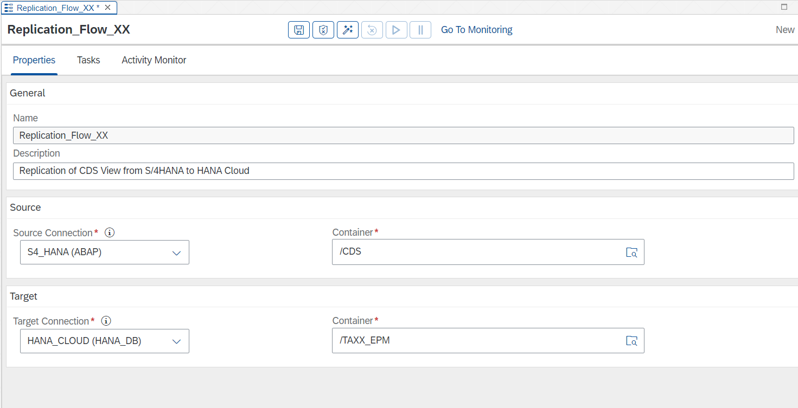

6. After filling the necessary properties for the Replication Flow, we click on the Tasks tab to replicate the CDS View **Z_CDS_EPM_SO_XX**. 
7. Click on the Create button to create a task for the CDS View replication

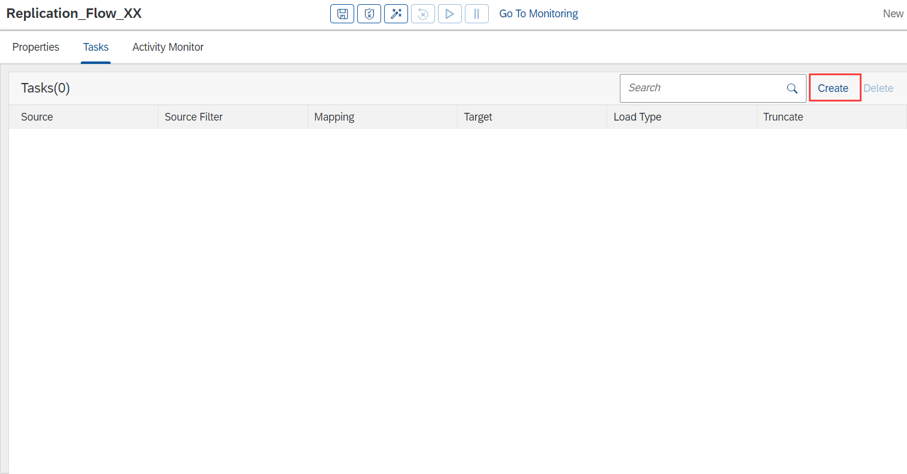

8. Select the CDS View by navigating to the TMP folder and click on the CDS View **Z_CDS_EPM_SO_XX**. To add the CDS View to the Replication Flow click the Ok button on the Pop-Up window
9. Repeat step 8 for the CDS views **Z_CDS_EPM_PO_XX** and **Z_CDS_EPM_PD_XX**.

10. After adding all three CDS views to the created Replication Flow, change the Load Type of each CDS View from Initial Only to Initial and Delta over the drop-down menu in the column Load Type.

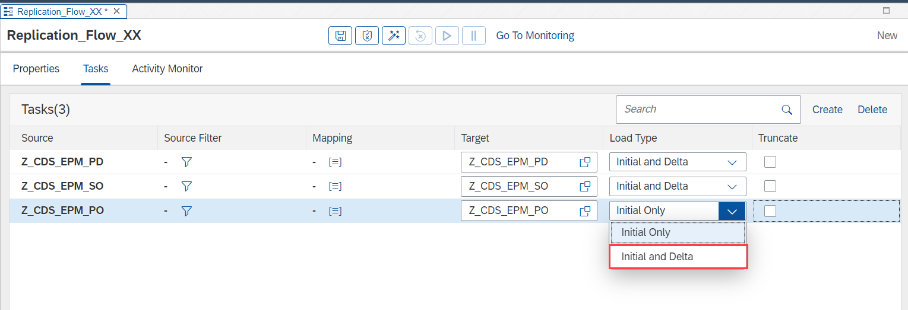

11. For the three CDS Views we define different preparations techniques which can be used for the replication. We differentiate between Filter and Mapping preparations
12. For the CDS View Z_CDS_EPM_PD_XX we create a new column for the target table. Click therefore in the Mapping Column on the 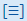 icon
    - In the opened window click on the Create Button to create a new column
    - Change the Column Name in the last field to the name **TimestampReplication**
    - Set the Data Type to timestamp from the drop down
    - Add for the Column Expression the following function: CURRENT_UTCTIMESTAMP
    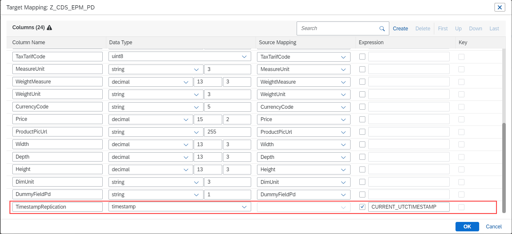
    - Click on the **OK** Button to save the mapping for the CDS View Z_CDS_EPM_PD_XX

13. For the CDS View Z_CDS_EPM_PO_XX we want to filter the column GrossAmount for all rows which are >= 800 €. Click to filter the CDS View on the  icon
    - Scroll on the opened window until the column GrossAmount
    - Click on the left side on the left side on the field GrossAmount
    - Change the = operator to an >= from the drop-down
    -  Enter in the Value field on the ríght side the value **800**
    -  
14. Click on the Validate button and then on the execution button to run the replication
15. After the replication is finished, click on the Data Intelligence Modeler banner at the top of the screen
16. In the Drop-Down menu click on the Metadata Explorer row to browse the replicated data

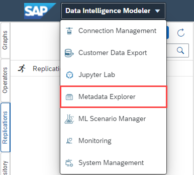

15. In the newly opened tab click on the Browse Connections option to navigate the HANA database we replicated our data to

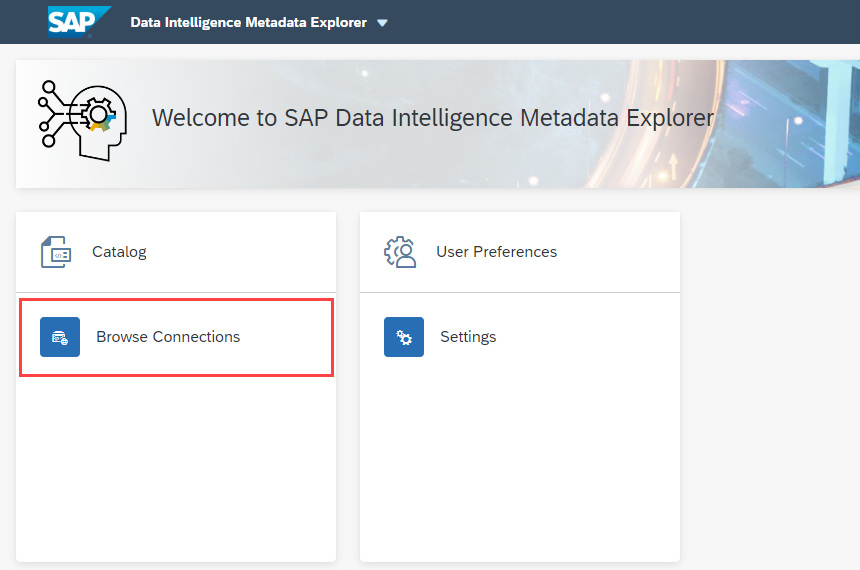

16. To navigate to the replicated datasets click through with the following steps
    - Click on HANA_CLOUD tile
    - Click on TECHED_DA281 tile
    - Click on the replicated datasets **Z_CDS_EPM_SO_XX**, **Z_CDS_EPM_PO_XX**, **Z_CDS_EPM_PD_XX**
    - Click for each dataset on the Data Preview tab and explore for each dataset the data replicated
17.  After the replication flow has successfully run and you explored the data, execute the Custom ABAP operator created in Exercise **Link_to_Custom_Operator_Ex** to create new sales orders